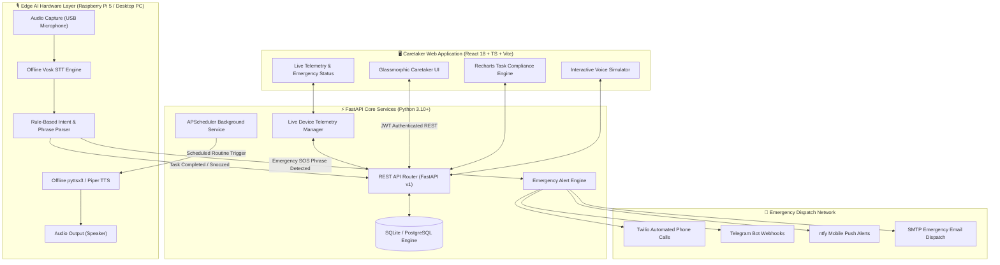
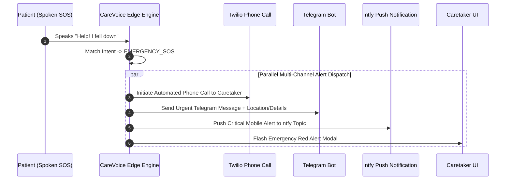
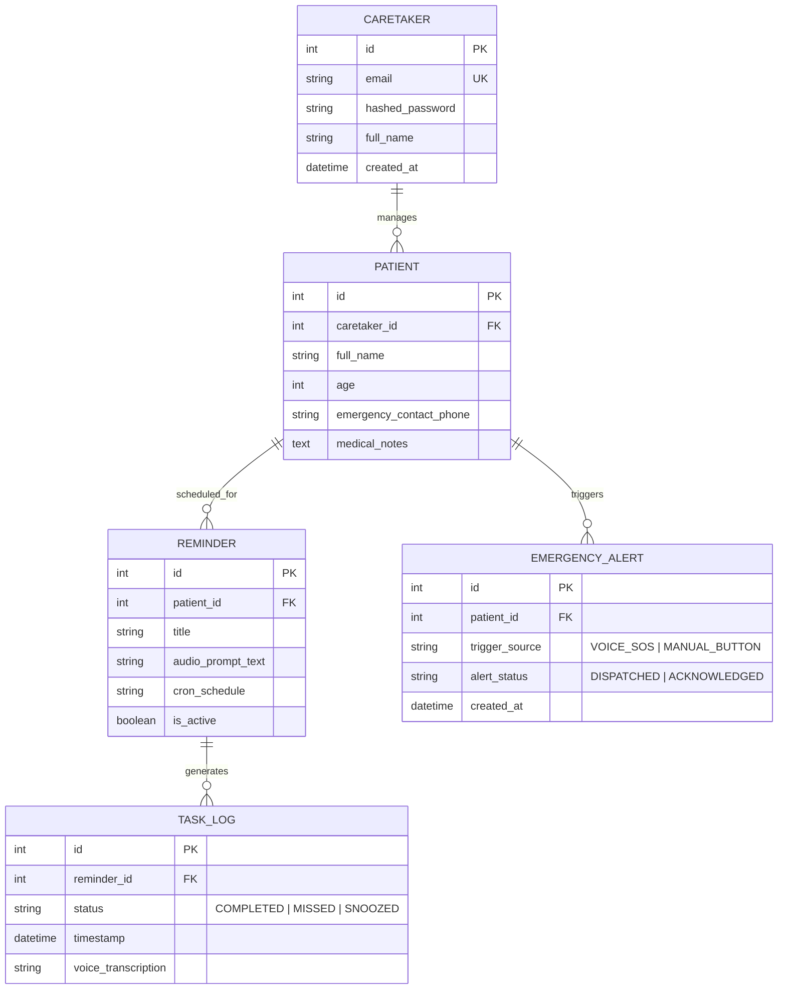

<div align="center">

# 🎙️ CareVoice Edge
### *Complete Offline Edge AI Voice Assistant & Caretaker Ecosystem*

[](https://fastapi.tiangolo.com)
[](https://reactjs.org/)
[](https://www.typescriptlang.org/)
[](https://vitejs.dev/)
[](https://tailwindcss.com/)
[](https://www.python.org/)
[](https://www.raspberrypi.com/)
[](LICENSE)

<br/>

[Project Overview](#-1-project-overview) •
[Core Modules & Architecture](#-2-core-modules--system-architecture) •
[Voice AI Engine](#-3-offline-edge-voice-ai-engine) •
[Emergency Protocol](#-4-emergency-sos--dispatch-protocol) •
[Caretaker Dashboard](#-5-caretaker-web-dashboard) •
[Database Architecture](#-6-database-architecture) •
[API Reference](#-7-rest-api-reference) •
[Step-by-Step Run Guide](#-8-step-by-step-guide-to-run-the-project)

</div>

---

# 📖 1. Project Overview

**CareVoice Edge** is a privacy-first, zero-cloud dependency Edge AI system engineered to assist elderly individuals and remote patients in maintaining their daily healthcare routines while giving caretakers real-time peace of mind.

Unlike traditional cloud voice assistants (e.g., Amazon Alexa, Google Assistant) that stream sensitive patient audio over the internet, CareVoice Edge executes **all speech recognition, text-to-speech synthesis, dynamic task scheduling, and intent parsing 100% locally on-device** (e.g., Raspberry Pi 5 or local edge gateway).

### 🎯 Why CareVoice Edge?

1. **100% Data Privacy & Security**: Patient voice input, medical prompts, and daily activity logs never leave the local device network.
2. **Zero Cloud Latency & Offline Operation**: Performs offline speech recognition (ASR) in under **180ms**, operating reliably even during complete internet outages.
3. **Proactive Spoken Audio Care**: Instead of relying on passive phone notifications, the system speaks reminders out loud via local speakers at scheduled times (e.g., *"It's time to take your 10mg Blood Pressure medicine"*).
4. **Natural Voice Verification**: Listens for verbal confirmations (*"I took it"*, *"Done"*, *"Finished"*) and automatically records compliance in the database.
5. **Immediate Emergency Response**: Detects spoken distress phrases (*"Help"*, *"Emergency"*, *"I fell down"*) and instantly triggers an outbound multi-channel alert mesh (Automated Twilio Phone Call, Telegram Bot, ntfy push notification, email).

---

# 🏗️ 2. Core Modules & System Architecture

The project is architected around a clean, decoupled layer separation combining a **FastAPI Clean Architecture Backend** with a **React 18 + TypeScript + Tailwind CSS Frontend**.



---

# 🎙️ 3. Offline Edge Voice AI Engine

The Voice Processing Subsystem operates concurrently inside the backend via non-blocking asynchronous audio loops:

- **Speech-to-Text (STT)**: Powered by the **Vosk ASR framework** utilizing a localized light footprint acoustic model (`vosk-model-small-en-us-0.15`). Audio samples are captured via `sounddevice` / `PyAudio` at 16kHz mono PCM.
- **Text-to-Speech (TTS)**: Uses `pyttsx3` (with native `espeak` fallback on Linux/Raspberry Pi OS) or Piper TTS to synthesize natural spoken audio locally.
- **Intent Parser**: Evaluates real-time transcriptions against rule-based fuzzy phrase trees:
  - `TASK_COMPLETED`: *"done"*, *"took medicine"*, *"finished"*, *"yes"*, *"already took it"*
  - `EMERGENCY_SOS`: *"help"*, *"emergency"*, *"fell down"*, *"i fell"*, *"call doctor"*
  - `SNOOZE`: *"later"*, *"snooze"*, *"remind me in 10 minutes"*

---

# 🚨 4. Emergency SOS & Dispatch Protocol

When an emergency keyword is recognized by the microphone listener or triggered manually from the Caretaker Dashboard, the Emergency Dispatch Engine executes a prioritized fail-safe alert protocol:



---

# 🖥️ 5. Caretaker Web Dashboard

The frontend Caretaker Dashboard provides a glassmorphic user interface designed with **React 18**, **TypeScript**, **Vite**, and **Tailwind CSS**.

### Key Pages & Features:
- **Overview Dashboard**: Instant visual stats on active patient status, upcoming reminders, compliance score percentage, and quick SOS triggers.
- **Task Compliance Analytics**: Interactive line & bar charts powered by **Recharts** displaying daily and weekly adherence trends.
- **Reminders Manager**: Add, edit, pause, or remove voice reminder routines with custom schedules.
- **Patient Profile**: Manage patient medical notes, emergency contact phone numbers, and care directives.
- **Interactive Voice Simulator**: Test voice prompts, simulate patient speech acknowledgments, and trigger test emergency flows directly from the browser.

---

# 💾 6. Database Architecture

CareVoice Edge uses SQLAlchemy ORM backed by SQLite (`carevoice.db`) for lightweight edge persistence (or PostgreSQL for enterprise gateways):



---

# 📡 7. REST API Reference

| Category | Method | Endpoint | Auth | Description |
| :--- | :---: | :--- | :---: | :--- |
| **Auth** | `POST` | `/api/v1/auth/login` | None | Authenticate caretaker & receive JWT token |
| **Patient** | `GET` | `/api/v1/patient/profile` | Bearer JWT | Fetch current patient details & emergency numbers |
| **Patient** | `PUT` | `/api/v1/patient/profile` | Bearer JWT | Update patient medical details |
| **Reminders** | `GET` | `/api/v1/reminders/` | Bearer JWT | List all scheduled audio reminders |
| **Reminders** | `POST` | `/api/v1/reminders/` | Bearer JWT | Create a new spoken reminder schedule |
| **Emergency** | `POST` | `/api/v1/emergency/trigger` | Bearer JWT | Manually trigger emergency alert mesh |
| **Analytics** | `GET` | `/api/v1/analytics/compliance` | Bearer JWT | Calculate compliance percentages & charts data |
| **Live Status**| `GET` | `/api/v1/live-status` | Bearer JWT | Check mic listener state & live prompt status |
| **Health** | `GET` | `/health` | None | Verify API & database operational status |

---

# 🚀 8. STEP-BY-STEP GUIDE TO RUN THE PROJECT

Follow these step-by-step instructions to get CareVoice Edge up and running locally on your computer.

---

### 📋 Prerequisites Checklist

Before running the project, ensure you have the following installed on your machine:
- **Python**: Version `3.10` or `3.11` ([Download Python](https://www.python.org/downloads/))
- **Node.js**: Version `v18.0.0` or higher ([Download Node.js](https://nodejs.org/))
- **Git**: Installed on your system ([Download Git](https://git-scm.com/))

---

### 🔹 Step 1: Open the Project Directory

Open your terminal or PowerShell and navigate to the project directory:

```powershell
cd d:\Antigravity_files\Carevoice-edge
```

---

### 🔹 Step 2: Set Up the Backend Environment

1. Navigate to the `backend` directory:
   ```powershell
   cd backend
   ```

2. Create a Python virtual environment:
   ```powershell
   python -m venv venv
   ```

3. Activate the virtual environment:
   - **Windows (PowerShell)**:
     ```powershell
     .\venv\Scripts\Activate.ps1
     ```
   - **Linux / macOS**:
     ```bash
     source venv/bin/activate
     ```

4. Install backend dependencies:
   ```powershell
   pip install -r requirements.txt
   ```

---

### 🔹 Step 3: Configure Environment Variables

Create your `.env` configuration file from the template:

```powershell
# On Windows PowerShell:
Copy-Item .env.example .env

# On Linux / macOS:
cp .env.example .env
```

*(Optional)* You can open the generated `.env` file to customize settings or add real Twilio/Telegram keys. By default, missing keys automatically fall back to safe dry-run mode for local testing.

---

### 🔹 Step 4: Set Up the Frontend Environment

1. Open a **new terminal window** and navigate to the `frontend` folder:
   ```powershell
   cd d:\Antigravity_files\Carevoice-edge\frontend
   ```

2. Install Node.js package dependencies:
   ```powershell
   npm install
   ```

---

### 🔹 Step 5: Launch the Application

You can launch both the backend and frontend using either the **One-Click Script (Windows)** or **Manual Dual-Terminal Commands**.

#### Option A: One-Click Startup Script (Windows Recommended)
Navigate to the root directory and run the included batch script:
```powershell
cd d:\Antigravity_files\Carevoice-edge
.\scripts\start_all.bat
```
*This automatically launches two separate terminal windows for the Backend API and Frontend Dashboard.*

#### Option B: Manual Dual-Terminal Execution

- **Terminal 1 (Backend API)**:
  ```powershell
  cd d:\Antigravity_files\Carevoice-edge\backend
  .\venv\Scripts\Activate.ps1
  python -m uvicorn app.main:app --reload --port 8000
  ```

- **Terminal 2 (Frontend Dashboard)**:
  ```powershell
  cd d:\Antigravity_files\Carevoice-edge\frontend
  npm run dev
  ```

---

### 🔹 Step 6: Access the Application & Login

Once both servers are running, open your web browser:

1. **Caretaker Web Dashboard**: Navigate to [http://localhost:5173](http://localhost:5173)
2. **Log In** using the default caretaker credentials:
   - **Email**: `caretaker@carevoice.local`
   - **Password**: `carevoice123`
3. **Swagger API Docs**: Explore interactive backend endpoints at [http://localhost:8000/docs](http://localhost:8000/docs)

---

### 🔹 Step 7: Run Automated Tests (Optional)

To verify backend integrity, database models, and API routes, run the pytest suite:

```powershell
cd d:\Antigravity_files\Carevoice-edge\backend
python -m pytest -v
```

---

## 📄 License

Distributed under the **MIT License**. See `LICENSE` for details.
