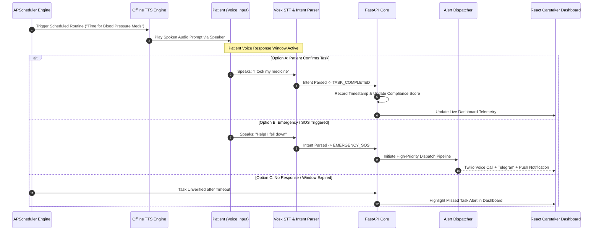

# CareVoice Edge 🎙️
### Offline Edge AI Voice Assistant & Caretaker Platform for Patient Care

[](https://fastapi.tiangolo.com)
[](https://reactjs.org/)
[](https://www.typescriptlang.org/)
[](https://vitejs.dev/)
[](https://tailwindcss.com/)
[](https://www.python.org/)
[](https://www.raspberrypi.com/)
[](LICENSE)

**CareVoice Edge** is a privacy-first, zero-cloud dependency Edge AI Voice Assistant designed for elderly and remote patient care. Combining offline automatic speech recognition (ASR), local text-to-speech synthesis (TTS), dynamic task scheduling, multi-channel emergency dispatching, and a high-performance glassmorphic caretaker dashboard, CareVoice Edge guarantees low latency and 100% data privacy.

---

## 🌟 Key Capabilities

- 🔒 **100% Offline Edge Intelligence**: Runs localized Speech-to-Text (Vosk ASR) and Text-to-Speech (`pyttsx3`/Piper) directly on-device without streaming patient voice audio to third-party cloud APIs.
- ⏰ **Proactive Spoken Audio Reminders**: Dynamic task scheduling driven by `APScheduler` announces personalized healthcare tasks (e.g., medication times, blood pressure checks).
- 🎙️ **Natural Voice Compliance Verification**: Real-time microphone listening engine parses natural verbal acknowledgments (e.g., *"I took my medicine"*, *"Finished"*) to automatically mark tasks completed.
- 🚨 **Real-Time Emergency & Fall Detection**: Listens continuously for critical SOS phrases (*"Help"*, *"Emergency"*, *"I fell down"*). Instantly triggers automated phone calls (Twilio), push notifications (ntfy), Telegram bot alerts, and email notifications.
- 📊 **Caretaker Web Dashboard**: A modern React + Vite + TypeScript dashboard featuring task compliance analytics (Recharts), patient profile management, live voice audio simulation, and immediate alert telemetry.

---

## 🏗️ System Architecture

```mermaid
graph TD
    subgraph Hardware & Edge Layer ["🎙️ Edge AI Hardware Layer (Raspberry Pi 5 / Desktop)"]
        MIC["Audio Input (Microphone)"]
        SPK["Audio Output (Speaker)"]
        VOSK["Offline Vosk STT Engine"]
        TTS["Offline pyttsx3 / Piper TTS"]
        INTENT["NLP Intent & Phrase Parser"]
    end

    subgraph Backend Services ["⚡ FastAPI Core Services (Async Python)"]
        API["REST API (FastAPI Router)"]
        SCHED["APScheduler Service"]
        EMERG["Emergency Alert Engine"]
        DB[(SQLite / PostgreSQL DB)]
    end

    subgraph Caretaker Dashboard ["🖥️ Caretaker Web Application (React 18 + TS)"]
        DASH["Glassmorphic Caretaker UI"]
        ANALYTICS["Recharts Compliance Analytics"]
        SIMULATOR["Live Voice Simulator & Telemetry"]
    end

    subgraph Alert Dispatchers ["🚨 Emergency Dispatch System"]
        TWILIO["Twilio Automated Phone Call"]
        TELEGRAM["Telegram Bot Webhook"]
        NTFY["ntfy Mobile Push Notification"]
        EMAIL["SMTP Email Dispatch"]
    end

    %% Component Interconnections
    MIC --> VOSK --> INTENT
    INTENT -->|Verified Voice Response| API
    INTENT -->|SOS Phrase Detected ("Help / Fall")| EMERG
    SCHED -->|Trigger Audio Prompt| TTS --> SPK
    API <--> DB
    DASH <-->|JWT Authenticated REST API| API
    ANALYTICS <--> API
    EMERG --> TWILIO & TELEGRAM & NTFY & EMAIL
```

---

## 🔄 Patient Voice Verification & SOS Workflow



---

## 📂 Repository Structure

```
Carevoice-edge/
├── backend/                  # FastAPI Clean Architecture Microservice
│   ├── app/
│   │   ├── api/v1/          # REST API Routers (Auth, Patient, Reminders, Emergency, Analytics)
│   │   ├── core/            # Security (JWT + bcrypt), Database Engine, Logging
│   │   ├── models/          # SQLAlchemy ORM Models
│   │   ├── schemas/         # Pydantic v2 Input/Output Schemas
│   │   └── services/        # Core Business Logic Layer
│   ├── scheduler/           # APScheduler Background Task Manager
│   ├── voice_engine/        # Offline TTS, Vosk ASR, Mic Listener & Intent Parser
│   ├── notifications/       # Multi-Channel Alert Engine (Telegram, ntfy, SMTP)
│   ├── calling/             # Twilio Automated Voice Dispatcher
│   └── tests/               # Pytest Automated Test Suite (In-Memory SQLite)
├── frontend/                 # Caretaker Web App (React 18 + TS + Vite + Tailwind)
│   └── src/
│       ├── api/             # Axios REST Client with Auth Interceptors
│       ├── components/      # UI Components, Live Voice Simulator, Compliance Charts
│       ├── context/         # AuthContext Provider (State & JWT Token Store)
│       └── pages/           # Dashboard, Reminders, PatientProfile, Analytics, Settings
└── scripts/                  # One-Click Environment & Deployment Scripts
```

---

## ⚡ Quick Start & Setup Guide

### 📋 Prerequisites
- **Python**: `3.10` or higher
- **Node.js**: `v18.0.0` or higher (with `npm`)
- **PortAudio / Sound Libraries**: System sound utilities for PyAudio/SoundDevice (Linux: `sudo apt install portaudio19-dev libasound2-dev`)

---

### 1. Backend Setup (FastAPI & Voice Engine)

```bash
# Navigate to backend
cd backend

# Create virtual environment (Optional but Recommended)
python -m venv venv
# On Windows:
venv\Scripts\activate
# On Linux/macOS:
source venv/bin/activate

# Install dependencies
pip install -r requirements.txt

# Configure Environment Variables
cp .env.example .env

# Run FastAPI Development Server
python -m uvicorn app.main:app --reload --port 8000
```

- 🌐 **Interactive API Documentation**: [http://localhost:8000/docs](http://localhost:8000/docs)
- ❤️ **Health Check Endpoint**: [http://localhost:8000/health](http://localhost:8000/health)

---

### 2. Frontend Setup (Caretaker Web Dashboard)

```bash
# Open a new terminal and navigate to frontend
cd frontend

# Install Dependencies
npm install

# Start Vite Development Server
npm run dev
```

- 🖥️ **Web Application**: [http://localhost:5173](http://localhost:5173)
- 🔑 **Default Caretaker Credentials**:
  - **Email**: `caretaker@carevoice.local`
  - **Password**: `carevoice123`

---

### 3. Automated Testing

Run the full pytest suite for API routes, scheduled jobs, and voice intent processing:

```bash
cd backend
python -m pytest -v
```

---

## 🍇 Raspberry Pi 5 Edge Deployment

For zero-cloud deployment on a Raspberry Pi 5:

1. **Hardware Connection**: Plug in USB Microphone array and 3.5mm/USB Speaker.
2. **Offline Vosk Language Model**: Download small English model into `backend/voice_engine/models/`:
   ```bash
   python -m vosk.download -m vosk-model-small-en-us-0.15
   ```
3. **Autostart Configuration**: Set up a `systemd` service for background execution on Pi boot:
   ```ini
   [Unit]
   Description=CareVoice Edge AI Engine
   After=network.target

   [Service]
   User=pi
   WorkingDirectory=/home/pi/Carevoice-edge/backend
   ExecStart=/home/pi/Carevoice-edge/backend/venv/bin/uvicorn app.main:app --host 0.0.0.0 --port 8000
   Restart=always

   [Install]
   WantedBy=multi-user.target
   ```

---

## 📡 REST API Reference Overview

| Method | Endpoint | Description |
| :--- | :--- | :--- |
| `POST` | `/api/v1/auth/login` | Authenticates caretaker & returns JWT Access Token |
| `GET` | `/api/v1/patient/profile` | Retrieves current patient profile & care requirements |
| `GET` | `/api/v1/reminders/` | Lists all active scheduled voice reminders |
| `POST` | `/api/v1/reminders/` | Creates a new voice reminder routine |
| `POST` | `/api/v1/emergency/trigger` | Triggers immediate multi-channel emergency alert |
| `GET` | `/api/v1/analytics/compliance` | Calculates task adherence percentages & historical trends |
| `GET` | `/health` | Edge device & database operational health status |

---

## 🛡️ Data Privacy & Security

- **Local Storage**: All patient data, voice logs, and care schedules are stored locally in SQLite (`carevoice.db`) or self-hosted PostgreSQL.
- **On-Device Audio Processing**: Audio buffers never leave RAM and are never streamed to remote endpoints.
- **JWT Authentication**: Caretaker REST API is secured with OAuth2 standard JWT bearer tokens and password hashing via `bcrypt`.

---

## 📄 License

Distributed under the **MIT License**. See `LICENSE` for details.
