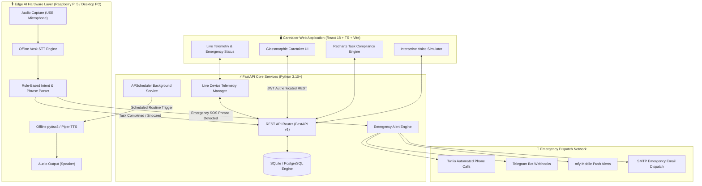
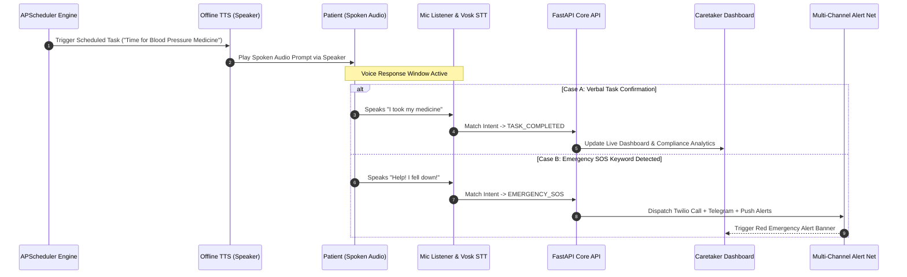
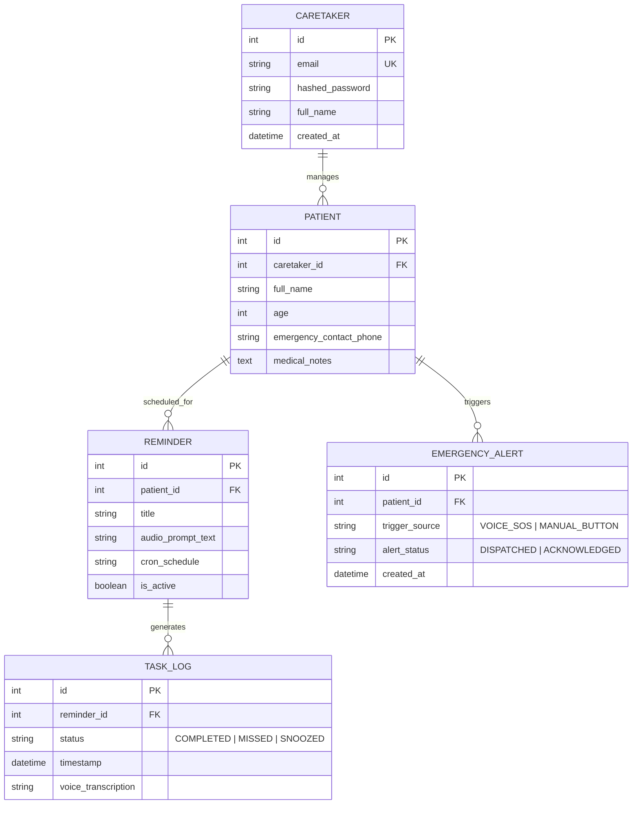

<div align="center">

# 🎙️ CareVoice Edge
### *Privacy-First, Offline Edge AI Voice Assistant & Caretaker Platform*

[](https://fastapi.tiangolo.com)
[](https://reactjs.org/)
[](https://www.typescriptlang.org/)
[](https://vitejs.dev/)
[](https://tailwindcss.com/)
[](https://www.python.org/)
[](https://www.raspberrypi.com/)
[](LICENSE)

<br/>

[Project Overview](#-1-project-overview) •
[Technology Stack](#-2-technology-stack) •
[System Architecture & Diagrams](#-3-system-architecture--diagrams) •
[Directory Structure](#-4-directory-structure) •
[API Reference](#-5-rest-api-reference) •
[Step-by-Step Installation & Setup](#-6-step-by-step-installation--setup-guide)

</div>

---

# 📖 1. Project Overview

**CareVoice Edge** is an autonomous, privacy-first Edge AI Voice Assistant and Caretaker Platform engineered specifically for elderly care and remote patient monitoring.

Unlike cloud-dependent voice assistants that stream voice data to third-party servers, CareVoice Edge processes **all voice listening, speech recognition (ASR), intent parsing, and text-to-speech (TTS) synthesis 100% locally on-device**. This design guarantees **low latency (<300ms)** and **100% patient data privacy**, functioning reliably even during internet outages.

### 🌟 Key Features
- 🔒 **100% Local On-Device AI**: Local speech-to-text (Vosk ASR) and text-to-speech synthesis (`pyttsx3`/Piper).
- ⏰ **Proactive Audio Reminders**: Scheduled spoken reminders for medication, blood pressure checks, and care routines.
- 🎙️ **Natural Voice Compliance**: Continuous microphone listening engine that recognizes verbal confirmations (*"I took it"*, *"Done"*).
- 🚨 **Real-Time Emergency SOS**: Instant detection of distress phrases (*"Help"*, *"Emergency"*, *"I fell down"*). Triggers an outbound multi-channel alert mesh (Twilio phone call, Telegram bot, ntfy push notification, email).
- 📊 **Caretaker Web Dashboard**: Glassmorphic React dashboard featuring task compliance analytics (Recharts), live voice audio simulation, and patient profile management.

---

# 💻 2. Technology Stack

| Layer | Technologies Used |
| :--- | :--- |
| **Edge AI Engine** | Vosk ASR, `pyttsx3`, Piper TTS, OpenWakeWord, `sounddevice`, NumPy |
| **Backend Core** | Python 3.10+, FastAPI 0.110+, Uvicorn, APScheduler, Loguru |
| **Database & Security** | SQLite / PostgreSQL, SQLAlchemy ORM v2, Alembic, JWT (OAuth2), `bcrypt` |
| **Alert Dispatchers** | Twilio Voice API, Telegram Bot API, ntfy Push, SMTP Email |
| **Frontend UI** | React 18, TypeScript 5, Vite, Tailwind CSS v3, Recharts, Lucide Icons |
| **Testing** | Pytest, HTTPX Async Client, SQLite In-Memory Isolation |

---

# 🏗️ 3. System Architecture & Diagrams

### 3.1 End-to-End System Architecture



---

### 3.2 Patient Voice Verification & SOS Sequence



---

### 3.3 Database ERD Schema



---

# 📁 4. Directory Structure

```
Carevoice-edge/
├── backend/                      # FastAPI Backend Microservice
│   ├── app/
│   │   ├── api/v1/              # REST Routers (Auth, Patient, Reminders, Emergency, Analytics)
│   │   ├── core/                # JWT Security, Config, Database Engine
│   │   ├── models/              # SQLAlchemy ORM Models
│   │   ├── schemas/             # Pydantic v2 Schemas
│   │   └── services/            # Business Logic Layer
│   ├── calling/                 # Twilio Voice Call Dispatcher
│   ├── notifications/           # Telegram, ntfy, SMTP Multi-Channel Alert Engine
│   ├── scheduler/               # APScheduler Background Manager
│   ├── voice_engine/            # Vosk STT, pyttsx3 TTS, Intent Parser, Mic Listener
│   └── tests/                   # Pytest Test Suite
├── frontend/                     # React Caretaker Dashboard
│   └── src/
│       ├── api/                 # Typed Axios Client with JWT interceptors
│       ├── components/          # Glassmorphic UI Components & Voice Simulator
│       ├── context/             # AuthContext Provider
│       └── pages/               # Dashboard, Reminders, PatientProfile, Settings
└── scripts/                      # One-Click Startup Scripts
```

---

# 📡 5. REST API Reference

| Category | Method | Endpoint | Auth | Description |
| :--- | :---: | :--- | :---: | :--- |
| **Auth** | `POST` | `/api/v1/auth/login` | None | Authenticate caretaker & return JWT token |
| **Patient** | `GET` | `/api/v1/patient/profile` | Bearer JWT | Retrieve patient details & emergency contacts |
| **Patient** | `PUT` | `/api/v1/patient/profile` | Bearer JWT | Update patient medical notes & details |
| **Reminders** | `GET` | `/api/v1/reminders/` | Bearer JWT | List all scheduled voice reminders |
| **Reminders** | `POST` | `/api/v1/reminders/` | Bearer JWT | Create a new voice reminder schedule |
| **Emergency** | `POST` | `/api/v1/emergency/trigger` | Bearer JWT | Manually trigger emergency alert mesh |
| **Analytics** | `GET` | `/api/v1/analytics/compliance` | Bearer JWT | Calculate compliance percentages & charts |
| **Live Status**| `GET` | `/api/v1/live-status` | Bearer JWT | Check mic listener state & live prompt status |
| **Health** | `GET` | `/health` | None | Verify API & database operational status |

---

# 🚀 6. Step-by-Step Installation & Setup Guide

Follow these step-by-step instructions to clone, configure, install dependencies, and run **CareVoice Edge** on any machine (PC / Mac / Linux / Raspberry Pi).

---

### 📋 Prerequisites

Ensure your system has the following installed:
- **Git**: Installed on your system ([Download Git](https://git-scm.com/))
- **Python**: Version `3.10` or `3.11` ([Download Python](https://www.python.org/downloads/))
- **Node.js**: Version `v18.0.0` or higher (`npm v9+`) ([Download Node.js](https://nodejs.org/))

---

### 🔹 Step 1: Clone the Repository

Open your terminal or command line interface and clone the repository:

```bash
git clone https://github.com/YOUR_USERNAME/Carevoice-edge.git
cd Carevoice-edge
```

---

### 🔹 Step 2: Set Up & Install Backend Dependencies

1. Navigate into the `backend` folder:
   ```bash
   cd backend
   ```

2. Create a virtual environment:
   ```bash
   python -m venv venv
   ```

3. Activate the virtual environment:
   - **Windows (PowerShell)**:
     ```powershell
     .\venv\Scripts\Activate.ps1
     ```
   - **Linux / macOS**:
     ```bash
     source venv/bin/activate
     ```

4. Install Python dependencies:
   ```bash
   pip install -r requirements.txt
   ```

5. Create your `.env` configuration file from `.env.example`:
   - **Windows**:
     ```powershell
     Copy-Item .env.example .env
     ```
   - **Linux / macOS**:
     ```bash
     cp .env.example .env
     ```

---

### 🔹 Step 3: Install Frontend Dependencies

1. Open a **new terminal window**, navigate to the repository root, and enter the `frontend` folder:
   ```bash
   cd Carevoice-edge/frontend
   ```

2. Install Node.js packages:
   ```bash
   npm install
   ```

---

### 🔹 Step 4: Run the Application

You can start the backend and frontend using either **Option A** (One-Click Script) or **Option B** (Manual Terminals).

#### Option A: One-Click Script (Windows)
From the project root folder:
```powershell
.\scripts\start_all.bat
```

#### Option B: Manual Terminal Execution

- **Terminal 1 (Backend Server)**:
  ```powershell
  cd backend
  .\venv\Scripts\Activate.ps1
  python -m uvicorn app.main:app --reload --port 8000
  ```

- **Terminal 2 (Frontend Caretaker Dashboard)**:
  ```bash
  cd frontend
  npm run dev
  ```

---

### 🔹 Step 5: Open Browser & Log In

1. **Caretaker Web Dashboard**: Open [http://localhost:5173](http://localhost:5173)
2. **Default Credentials**:
   - **Email**: `caretaker@carevoice.local`
   - **Password**: `carevoice123`
3. **Interactive API Documentation (Swagger)**: Open [http://localhost:8000/docs](http://localhost:8000/docs)

---

### 🔹 Step 6: Verify with Pytest (Optional)

To execute backend automated unit & integration tests:

```bash
cd backend
python -m pytest -v
```

---

## 📄 License

Distributed under the **MIT License**. See `LICENSE` for details.
